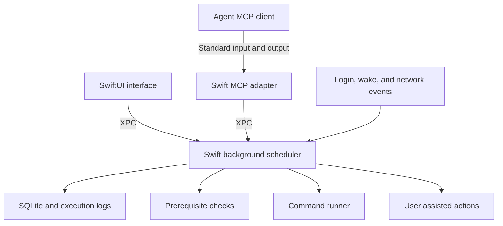

# Run Eventually design

Status: Initial design for implementation planning

Date: October 3, 2026

Run Eventually is a macOS app for scheduled commands that may need to wait for usable credentials, a VPN, or other conditions. A scheduled time establishes when work becomes due. The app retains that work and starts it when its prerequisites are satisfied, including after the laptop wakes or the user logs in following a shutdown.

The initial architecture uses Swift throughout: a SwiftUI interface, a separate background scheduler, and a local MCP adapter. All three ship in one app bundle. The scheduler persists outstanding work and execution history in SQLite so that its correctness does not depend on a timer firing or the interface remaining open.

This document records the agreed product scope and proposes implementation defaults. Defaults identified below should be validated during the first implementation milestone.

## Product scope

The first release targets macOS only and supports:

- One-time and recurring schedules with catch-up after sleep, shutdown, or service downtime.
- A command, arguments, working directory, and explicit environment for each task.
- Reusable prerequisites, initially network access, Google Cloud authentication, and custom check commands.
- Browser-assisted sign-in and other manual actions that can be followed by an automatic readiness check.
- A graphical task list, actionable blockers, execution history, and logs.
- Local MCP tools for agents to create and manage tasks and inspect their outcomes.
- Installation as a normal Mac app with background scheduling enabled at login.

Each task is one executable unit. Its creator handles sequencing through a Make target, script, or other command. Dependencies between tasks and workflow graphs are outside the first release.

General interactive terminal sessions, remote execution, Linux support, and replaying every missed recurrence are deferred. The app does not promise execution while the Mac is asleep, powered off, or before the user logs in. It catches up when execution becomes possible.

## Architecture

### Components and ownership

| Component | Responsibility |
| --- | --- |
| App interface | Task editing, status, history, prerequisite setup, user attention, and background-service settings. |
| Background scheduler | Schedule evaluation, durable state, checks, command execution, cancellation, recovery, and the local task API. |
| MCP adapter | Translate MCP requests into calls to the same API used by the interface. |
| Shared Swift package | Task models, schedule rules, state transitions, API messages, and testable scheduling logic. |
| macOS integration layer | Service registration, wake and network observation, process management, notifications, and local IPC. |

The background scheduler is the sole writer of scheduling state and the sole authority for starting commands. Neither the interface nor an MCP connection creates an independent scheduler. Multiple clients can connect at once, and disconnecting a client does not cancel accepted scheduled work.

The scheduler runs as a per-user LaunchAgent managed by `launchd`. The app registers its bundled helper through `SMAppService` and displays the actual registration and approval state. Apple provides this registration model on macOS 13 and later; the deployment target remains an implementation decision. [Apple service management](https://developer.apple.com/documentation/servicemanagement/smappservice)

Configure service startup and restart so that scheduling continues when the interface quits and recovers after a helper crash. XPC is the proposed communication mechanism for both the interface and MCP adapter. The API should use versioned messages and return a clear compatibility error if client and service versions differ during an update.

Swift keeps native integration and shared models in one toolchain. A Go service would be worth reconsidering if a portable engine becomes a concrete requirement. The official Swift MCP SDK already provides the local standard-input/output transport needed here. [Swift MCP SDK](https://github.com/modelcontextprotocol/swift-sdk)

## Task and execution model

The following are logical records; the exact database schema can follow during implementation.

| Record | Principal contents |
| --- | --- |
| Task | ID, name, enabled state, command configuration, schedule and time zone, prerequisite references, execution policy, revision, and schedule cursor. |
| Prerequisite | ID, name, provider type, configuration, configuration revision, and optional resolution action. |
| Run | ID, task revision, trigger, represented scheduled time or range, state, blockers, and lifecycle timestamps. |
| Attempt | ID, run ID, process identity, start and end times, exit result, and log references. |
| Resolution session | ID, prerequisite and revision, state, initiating user action, start and end times, and safe diagnostic summary. |

A task is the persistent definition. A run represents one request to execute it, which can cover several missed occurrences. An attempt is an actual command launch; retrying a run creates another attempt. Checking prerequisites and waiting for sign-in do not create execution attempts.

Proposed edit behavior: runs with no launch claim adopt definition edits while preserving their represented due times and an audit of the change. At the first durable launch claim, the run's command and execution policy become immutable, including for retries. Newly due work accumulates in a separate pending run using the current task revision. Prerequisite edits invalidate cached checks and cause pending work to re-evaluate the new configuration. History records which prerequisite configuration was checked before each launch.

SQLite stores definitions, schedule progress, runs, attempts, and resolution state in the user's Application Support directory. Ordinary command output goes to bounded log files referenced by the database. Credentials and tokens are not part of task records; use references to existing credential configurations or Keychain-backed secrets where needed.

## Scheduling and catch-up

### Durable reconciliation

The scheduler repeatedly reconciles persisted state with the current time:

1. Determine which enabled schedules have become due since their persisted cursor.
2. Create or extend pending runs and advance the cursor in the same database transaction.
3. Refresh prerequisite results that are stale or affected by an event.
4. Select eligible work within per-task and global concurrency limits.
5. Recheck required conditions and transactionally claim a run before launching its command. At the claim, revalidate pause, cancellation, and configuration revisions so a concurrent edit cannot be bypassed by an older check result.
6. Record the process start and completion, then reconsider newly eligible work.

Reconciliation runs on service startup, wake, relevant network changes, configuration changes, command or resolution completion, and timers. Set timers for the next due occurrence or check, with a periodic fallback while the machine is awake. Proposed initial fallback: once per minute, with bounded backoff for failing checks and immediate reconsideration on relevant events.

Wake notifications improve responsiveness; persisted schedule progress provides correctness when notifications are missed. Apple exposes `NSWorkspace.didWakeNotification` for wake observation. [Apple wake notification](https://developer.apple.com/documentation/appkit/nsworkspace/didwakenotification)

The service owns recurrence evaluation. It does not create an operating-system cron entry for each task. Apple's calendar-based `launchd` jobs can catch up after sleep, but their documented behavior differs after power-off and does not provide this application's prerequisite and history model. [Apple timed jobs](https://developer.apple.com/library/archive/documentation/MacOSX/Conceptual/BPSystemStartup/Chapters/ScheduledJobs.html)

### Proposed scheduling defaults

| Situation | Behavior |
| --- | --- |
| One-time task is overdue | Retain it until executed, cancelled, or explicitly expired. No expiry by default. |
| Several recurring occurrences are missed | Represent them as one pending catch-up run; retain the first and latest due times and occurrence count for explanation. |
| Another occurrence becomes due while an unstarted run waits on prerequisites | Extend the pending catch-up run without resetting its original lateness. |
| Another occurrence becomes due while a run is starting, executing, or retrying | Keep at most one coalesced follow-up run. Finish the current run's retry policy before launching the follow-up. |
| Same task is already executing | Never launch an overlapping attempt. |
| Many tasks become ready together | Apply a small global execution limit; initially propose two simultaneous commands. |
| A task is paused | Stop creating new automatic work and starting pending work or retries; allow an executing attempt to finish. Preserve the cursor for catch-up on resume. |
| A task is resumed | Reconcile the paused period into one catch-up run, combining it with pending scheduled work where applicable. |
| User requests Run now | Still enforce prerequisites and non-overlap. A paused task returns an instruction to resume first. Otherwise return the active run if present, then the pending run if present, or create a manual run. This does not bypass a retry delay or a user-start requirement. |

An active run includes the starting state and its queued retries. The normal bound is one active run and one pending follow-up per task. With retries disabled by default, this means at most one starting or executing run and one pending run.

Cancelling a run resolves that run's represented occurrences; it does not pause the recurring schedule. For an active attempt, cancellation is not terminal until process termination is verified. Keep the per-task slot reserved while stopping it; if termination cannot be established, use the unknown-outcome recovery path. Apply the same termination rule to execution timeouts. An expiry deadline prevents new attempts, while an execution timeout governs an attempt that is already running.

A terminal failed run does not silently retry on every reconciliation; a later recurrence can create new work. Completing an older run never clears its pending follow-up. Recurrence stays anchored to scheduled calendar times, so finishing today's 6:30 task at 8:00 does not move tomorrow's due time.

Task removal pauses future scheduling, cancels unstarted work, and retains history. An already executing attempt may finish; stopping it requires an explicit cancellation. Reject deletion of a referenced prerequisite until its references are deliberately reassigned or removed, so deletion cannot silently remove a launch condition.

When a schedule is created, calculate future occurrences from its effective time. Do not invent a backlog from before the schedule existed. On an edit, atomically preserve or materialize due intent under the old schedule through the edit boundary, including while paused, then apply the new schedule to future occurrences. This prevents an edit from erasing overdue work that had not yet been materialized. An explicitly supplied one-time timestamp in the past becomes due immediately.

### Calendar behavior

Support one-time timestamps and calendar recurrence, with a human-readable daily or weekly editor. Cron-style input can map to the same schedule representation once its supported syntax is specified; it is an input format, not the execution engine.

Persist a named time zone, defaulting to the Mac's zone at creation, plus calculated UTC due times. Proposed v1 behavior keeps that zone fixed when the user travels. For daylight-saving transitions, run a repeated local time once and move a nonexistent local time to the first valid instant after the gap. Display upcoming occurrences so these choices are visible.

Persisted occurrence identity and cursor updates prevent a backward clock adjustment from creating duplicate work. A forward clock change invokes ordinary catch-up. Use elapsed-time measurements for active execution timeouts rather than calendar timestamps; sleep accounting for those timeouts must be specified and tested in the first milestone.

## Prerequisites

A task references named prerequisite configurations, and all attached prerequisites must pass before launch. Several tasks can share a configuration such as “Work network” or “Google Cloud work account.”

Each check returns a structured result: `ready`, `blocked`, or `check_error`, with a safe explanation, check time, and next check time. Unknown or failed checks block execution. Configuration errors should be distinguished from temporary unavailability so the interface can suggest a useful next action.

Check commands have short timeouts and bounded output. Cache and deduplicate checks by configuration revision and effective execution context, including the resolved credential source, account, configuration paths, and relevant environment. Two tasks referencing the same prerequisite may still require separate results if their execution contexts differ. Apply freshness rules appropriate to the provider. Check scheduling and user-assisted actions use separate capacity from normal task execution, so blocked tasks cannot exhaust execution slots.

| Provider | Readiness check | Optional resolution |
| --- | --- | --- |
| Network or VPN | Probe a configured internal DNS, TCP, or HTTPS endpoint. Add a connection-specific check when the requirement is explicitly a particular VPN. | Explain how to connect, then offer Recheck. |
| Google Cloud CLI credentials | Verify usable credentials for the configured account and CLI configuration in the task's execution environment. | Run the corresponding local browser sign-in command. |
| Google Application Default Credentials | Verify the ADC source actually selected by the task's environment. | Offer a compatible login action when that source supports it. |
| Custom command | Run a configured check; exit 0 means ready, exit 1 means blocked, and other exits, launch failures, or timeouts mean check error. | Display creator-supplied instructions in v1. |

An internal endpoint probe demonstrates reachability, not proof that a specific VPN is active. Likewise, obtaining a Google token demonstrates credential usability, not permission for every intended API operation. Tasks still need normal failure handling after passing preflight checks.

Google CLI credentials and ADC are distinct. ADC can also be selected through environment configuration, so a default login must not be offered as a fix when it would update a credential source the task does not use. Never include access tokens in diagnostic output. [Google ADC behavior](https://docs.cloud.google.com/docs/authentication/application-default-credentials)

Conditions can change immediately after a check. V1 treats them as launch prerequisites, rather than a promise that they remain true for the full execution. The command owns recovery from connection or authentication loss during its work.

## User assistance and Google sign-in

Browser-assisted authentication is in scope for v1. A prerequisite may expose a user-triggered resolution action without becoming another scheduled task or introducing task-to-task dependencies.

For Google authentication:

1. A due task fails its credential check and remains pending with “Needs sign-in.”
2. The app surfaces the blocker and, if notifications are enabled, sends one notification for that attention episode.
3. The user selects Sign in. The service starts the matching Google authentication command and records a resolution session.
4. The command opens the browser and handles the authentication exchange. The app displays “Waiting for sign-in” with Cancel.
5. When the command exits, the service checks the credentials again. A successful command exit alone does not establish that the task's prerequisite is satisfied.
6. Eligible pending tasks resume automatically.

In the normal local-browser flow, the user completes sign-in in the browser and the command receives completion without a manual answer in the terminal. Browser callbacks, including local loopback communication where used, belong to the Google command. Run Eventually does not implement that OAuth exchange or embed a browser. [Google CLI authentication](https://docs.cloud.google.com/sdk/docs/authenticate), [Google desktop OAuth](https://developers.google.com/identity/protocols/oauth2/native-app)

Only one resolution session may mutate a particular credential store at a time, even if several prerequisite records reference that store. Compatible requests share its progress; a conflicting account or source request waits and must not reuse another context's readiness result. Recheck each affected context after resolution. Polling, wake events, and agent requests must not repeatedly launch browsers. A user may also sign in independently; ordinary rechecks discover that change and release waiting work.

Resolution has its own timeout and cancellation behavior, independent of a task's attempt budget. Cancellation stops the owned authentication process but may leave its browser tab open. Recheck afterward because authentication may have completed concurrently. After a service restart, reconcile the process and credential state; an abandoned session requires a new user action rather than silently relaunching login.

Track resolution as starting, waiting for sign-in, verifying, succeeded, failed, cancelled, or interrupted. Before releasing its credential-store lock or launching a replacement, establish that the previous process has stopped. A configuration edit invalidates an older session's readiness result; always verify the current revision and execution context before releasing pending tasks.

Keep authentication output out of ordinary task logs and MCP responses. Persist safe status summaries rather than raw OAuth URLs, authorization codes, or tokens. Apply the same sensitive-output policy to resolution sessions and standalone tasks declared as authentication commands: disable raw output persistence and exposure through MCP. Custom commands can opt into this policy as well.

A standalone task may declare that it requires the user to start it. Once due and otherwise eligible, it shows “Ready for you to start”; after the click, the scheduler launches its command and waits for completion. This supports known browser-assisted commands. Declare this mode explicitly rather than trying to infer interactivity from arbitrary output.

Commands requiring arbitrary terminal input, password prompts, or terminal interfaces are deferred to v2. V1 does not supply interactive standard input. Known integrations should report unsupported prompt modes clearly, with a bounded timeout for commands whose behavior cannot be detected reliably.

## Execution and recovery

### Process execution

Store executable and arguments separately. A shell script or Make target is a valid executable unit; shell interpretation must be explicit. Configure the working directory and environment, including executable search paths and credential settings. Do not depend on the current Terminal directory or silently source interactive shell startup files.

The runner captures standard output and error subject to the sensitive-output policy, plus exit status and timing. It supports cancellation and a configured execution timeout, with graceful termination followed by forced termination of the owned process group when necessary. Launch prerequisites do not terminate running work merely because they later become unavailable.

Proposed v1 execution retries are disabled by default. Creators may enable a bounded number of retries with backoff for commands that are safe to repeat. Rechecking a missing prerequisite is always separate from rerunning a command. User-assisted commands require a fresh user start for a retry.

The Mac may sleep during execution. Existing processes can resume afterward, while their network operations may fail. Wake reconciliation must not mistake a suspended command for an unstarted task and launch a duplicate. V1 does not attempt to force the machine awake.

### Run states

| State | Meaning |
| --- | --- |
| Pending | Due work is retained; the run may be waiting on prerequisites, capacity, or task resume. |
| Awaiting user | A declared assisted command is ready for user initiation. |
| Starting | A durable claim exists and process launch is underway. |
| Running | An execution attempt is active. |
| Retry pending | The current run has another permitted attempt after its retry delay and readiness checks. |
| Succeeded | A successful result was recorded. |
| Failed | Execution failed and no automatic attempts remain. |
| Cancelled or expired | The run was explicitly cancelled or reached its configured expiry. |
| Outcome unknown | Recovery cannot establish whether an attempt completed or produced external effects. |

Blocker reasons and prerequisite resolution state are separate from the run state. For example, a pending run can show “Needs sign-in” while a resolution session is in progress. Paused is a task setting, not evidence that an existing process has stopped.

### Crash ambiguity

Transactionally claiming a run and enforcing a single scheduler prevents ordinary duplicate launches. It cannot make a database transaction atomic with process creation or an external command's side effects.

Persist a launch intent before spawning, then persist verifiable process identity and completion. On restart, reconcile owned processes before admitting another run of the same task. A PID alone is insufficient identity because it may have been reused. If ownership or outcome cannot be established, report “Outcome unknown” and hold that task's queued work until the user resolves it. Do not automatically rerun an ambiguous attempt, even when normal failure retries are enabled.

Resolving an unknown outcome must establish that the old process is no longer active before another launch. A user can then acknowledge the occurrence or request a retry. Creators remain responsible for making repeated external effects safe where automatic retries are desired.

The first implementation milestone must prove recovery across the gaps before launch, after spawn, and after command completion but before result persistence. If reliable process reconciliation needs a small execution supervisor, introduce it inside the runner boundary before claiming restart-safe execution.

## Interface

The main window shows task name, enabled state, next scheduled time, last result, and current status. Useful statuses include “Waiting for VPN since 6:30,” “Needs sign-in,” “Running,” and “Outcome unknown.”

A task detail view contains command settings, schedule preview, prerequisites, pending-run details, execution policy, history, and logs. Expose Pause, Resume, Run now, Cancel run, Recheck, and any available resolution action with clear effects.

A shared prerequisite view shows which tasks are blocked, the last check, the next check, and an action to resolve the condition. The interface also distinguishes a disconnected scheduler from a healthy scheduler with no work. Quitting the interface leaves background scheduling enabled; disabling background scheduling is a separate explicit setting.

Notifications focus on newly required user action or a meaningful failure. Repeated checks should not repeatedly notify about an unchanged blocker. A menu-bar summary is useful but optional for the first end-to-end milestone.

## MCP interface

Ship a small local executable that serves MCP over standard input and output and forwards calls through the local scheduler API. Keep protocol output separate from diagnostics. Each MCP client may start its own adapter; all adapters reach the same background scheduler.

The initial tool surface should cover:

- Create, inspect, update, list, pause, resume, and remove task definitions.
- Request a run and cancel a run.
- List prerequisites and inspect or refresh their status.
- List runs and read bounded execution logs and safe error summaries.

Creation accepts the schedule, time zone, executable configuration, prerequisite references, and execution policy. Responses contain stable task and run IDs plus readable schedule and status summaries. Mutations accept an idempotency key so a retried request does not create duplicate work; updates also carry an expected revision to reject stale edits. A scheduling call succeeds only after its state is committed durably.

An MCP client can discover that user attention is required, but cannot initiate built-in sign-in actions or satisfy a declared user-start requirement. A run request for an assisted task returns its pending run and attention state; initiation happens through the app's user action. Agent-created tasks use the same validation and execution rules as tasks created in the interface. Custom commands must declare their interaction mode; the scheduler cannot reliably infer it from their contents.

This is a trusted local execution interface: an authorized client can schedule commands with the user's privileges. Keep it local in v1, restrict local IPC to the expected user and bundled clients, and validate task inputs consistently. Adding a network MCP endpoint would require a separate authentication and authorization design.

## Packaging and operation

Distribute a single signed and notarized app bundle with the interface, LaunchAgent, and MCP adapter. A directly distributed, unsandboxed app is the proposed fit for running user-selected tools and scripts against local resources. App Store distribution requires App Sandbox and would introduce additional execution and file-access constraints. Existing macOS privacy controls still apply. [Apple App Sandbox](https://developer.apple.com/documentation/security/protecting-user-data-with-app-sandbox), [Apple notarization](https://developer.apple.com/documentation/security/notarizing-macos-software-before-distribution)

On first launch, explain and enable background scheduling through the supported service registration flow, display any required system approval, and provide a copyable MCP client configuration referencing the installed adapter. Normal operation does not require a privileged system daemon.

Store state outside the app bundle so an app replacement preserves schedules and history. Updates must coordinate service restart, schema migrations, and active executions. For v1, defer a disruptive update while commands are running; the migration and backup strategy must be specified before distribution. Define bounded history and log retention, with visible controls, before the first packaged release.

## Implementation milestones

### Durable scheduler

Build the shared models, SQLite storage, recurrence evaluation, process runner, and bundled LaunchAgent. Prove catch-up, non-overlap, cancellation, and recovery with a minimal local client before adding the full interface.

### Prerequisites and interface

Add reusable network, Google credential, and custom checks; browser-assisted resolution; task creation; actionable status; and execution history. Verify the complete morning workflow below.

### MCP and distribution

Expose the shared API through MCP, validate multiple simultaneous clients, and package the signed app. Verify login startup, background approval states, interface exit, service restart, and update behavior on an installed build.

## Acceptance scenarios

1. A daily task due at 6:30 remains due while the Mac sleeps. At 8:00 wake, it shows “Waiting for VPN.” Once VPN is available, it shows “Needs sign-in” if required. After browser sign-in, it runs once and records its original due time.
2. The Mac is powered off across several daily occurrences. On the next login, the app creates one catch-up run, without replaying every missed day.
3. Several tasks share expired credentials. They show one shared resolution action and produce only one concurrent login session. Independent tasks can continue running.
4. The user authenticates outside the app. A recheck recognizes the usable credentials and releases pending work.
5. The interface closes or an MCP adapter exits. The background scheduler retains accepted work and continues execution.
6. A task is still running when its next occurrence becomes due. No overlapping attempt starts; at most one follow-up accumulates.
7. A prerequisite stays unavailable for hours. The run remains pending, checks back off within their configured bound, and notifications do not repeat continuously.
8. A command fails. It remains failed without implicit retries unless its explicit retry policy allows another attempt.
9. The helper crashes at each process-launch and completion boundary. Recovery avoids a duplicate start and reports an unknown outcome when necessary.
10. A repeated MCP creation request with the same idempotency key returns the existing task. Conflicting reuse of that key is rejected.
11. Pausing and resuming, schedule edits, daylight-saving transitions, and clock changes follow the documented semantics without losing or duplicating due work.
12. Cancelling or timing out sign-in leaves the original task pending and permits a later user-initiated attempt.
13. Tasks using different ADC sources never share a cached credential result merely because they reference the same prerequisite. Duplicate prerequisite records targeting one credential store cannot start competing sign-in sessions.
14. Editing a prerequisite during login does not allow the old session's result to satisfy the new configuration without a fresh check. An MCP run request for an assisted task preserves its user-start requirement.

Use an injected clock and fake condition providers to exercise schedule and state transitions deterministically. Use integration tests for real subprocess lifecycle and recovery, and installed-app checks for login, sleep and wake, browser authentication, and background approvals.

## Decisions to validate during implementation

- Minimum macOS version, SQLite access library, and the exact XPC message encoding.
- Supported recurrence and cron syntax, including preview behavior and daylight-saving policies.
- Check intervals, timeouts, retry limits, fairness, and the initial global concurrency limit.
- Timeout accounting across sleep and the process identity or supervisor mechanism used for crash recovery.
- Google account and credential-source configuration, plus which VPN checks are practical for the user's setup.
- History retention, notification preferences, and the first distribution and update workflow.
